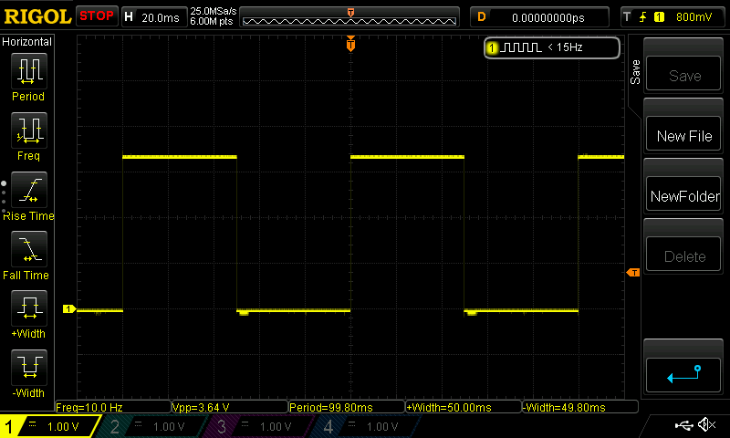

# *Nanolay* : Collection of Custom dsPIC33CK Library

| Parameter         | Value                           |
| ----------------- | ------------------------------- |
| Revision          | A                               |
| Target Device     | DSPIC33CK256MP202               |
| Development Board | Nanolay RevA                    |
| Author            | Mark Angelo Tarvina (mttarvina) |
| Email             | mttarvina@gmail.com             |

-----------------------------------------------------------------------------------------------------------------------------------------------------------------------------------------------------------


## 0. Wishlist

* Add function API in Core library to enable Reference Oscillator Output and assign it to a specific output pin
* Add function API in Core library to enable Input Change Notification on a specific GPIO pin


-----------------------------------------------------------------------------------------------------------------------------------------------------------------------------------------------------------


## I. Datasheet Overview

### A. Pinout


### B. Oscillator


#### B.1. Primary PLL

The Primary Oscillator and internal FRC Oscillator sources can optionally use an on-chip PLL to obtain higher operating speeds.
For PLL operation, the following requirements must be met at all times without exception:

* The PLL Input Frequency (FPLLI) must be in the range of 8 MHz to 64 MHz
* The PFD Input Frequency (FPFD) must be in the range of 8 MHz to (FVCO/16) MHz
* The VCO Output Frequency (FVCO) must be in the range of 400 MHz to 1600 MHz


#### B.2. Auxiliary PLL

The dsPIC33CK256MP508 device family implements an Auxiliary PLL (APLL) module, which is used to generate various peripheral clock sources independent of the system clock.
For APLL operation, the following requirements must be met at all times without exception:

* The APLL Input Frequency (AFPLLI) must be in the range of 8 MHz to 64 MHz
* The APFD Input Frequency (AFPFD) must be in the range of 8 MHz to (AFVCO/16) MHz
* The AVCO Output Frequency (AFVCO) must be in the range of 400 MHz to 1600 MHz


### C. GPIO


#### C.1. GPIO: Registers

* The Data Direction register (TRISx) determines whether the pin is an input or an output. If the data direction bit is a ‘1’, then the pin is an input.
* All port pins are defined as inputs after a Reset. Reads from the latch (LATx), read the latch. Writes to the latch, write the latch. Reads from the port (PORTx), read the port pins, while writes to the port pins, write the latch.
* When a pin is shared with another peripheral or function that is defined as an input only, it is nevertheless regarded as a dedicated port because there is no other competing source of outputs.
* Port pins can also be individually configured for either digital or open-drain output. This is controlled by the Open-Drain Enable for PORTx register, ODCx, associated with each port. Setting any of the bits configures the corresponding pin to act as an open-drain output. 
* The port pins that are to function as analog inputs or outputs must have their corresponding ANSELx and TRISx bits set
* In order to use port pins for I/O functionality with digital modules, such as timers, UARTs, etc., the corresponding ANSELx bit must be cleared.
* If the TRISx bit is cleared (output) while the ANSELx bit is set, the digital output level (VOH or VOL) is converted by an analog peripheral, such as the ADC module or comparator module.
* When the PORTx register is read, all pins configured as analog input channels are read as cleared (a low level)
* Pins configured as digital inputs do not convert an analog input. Analog levels on any pin, defined as a digital input (including the ANx pins), can cause the input buffer to consume current that exceeds the device specifications.

| Register | Description                         | 0 Value                                      | 1 Value                                      |
| -------- | ----------------------------------- | -------------------------------------------- | -------------------------------------------- |
| TRISx    | Output enable for port register     | OUTPUT                                       | INPUT                                        |
| ANSELx   | Analog select for port register.    | Analog input DISABLED, Digital input ENABLED | Analog input ENABLED, Digital input DISABLED |
| PORTx    | Input data for port register        | n/a                                          | n/a                                          |
| LATx     | Output data for port register       | LOW                                          | HIGH                                         |
| ODCx     | Open-drain enable for port register | DISABLED                                     | ENABLED                                      |
| CNPUx    | Pull-up enable for port register    | DISABLED                                     | ENABLED                                      |
| CNPDx    | Pull-down enable for port register  | DISABLED                                     | ENABLED                                      |


#### C.2. Unused I/O

* Unused I/O pins should be configured as outputs and driven to a logic low state.
* Alternatively, connect a 1k to 10k resistor between VSS and unused pins, and drive the output to logic low.


### D. Timer1

**NOTE: For the Core library, the Timer1 is used as general purpose timer interrupt, thus Timer1 specifically operates in timer mode.


#### D.1. Timer1: Overview

Timer1 module is a 16-bit timer/counter consisting of the following readable/writable registers:

* TMR1: 16-bit Timer Count register
* PR1: 16-bit Timer Period register associated with the timer
* T1CON: 16-bit Timer Control register associated with the timer

Timer1 module also has these associated bits for interrupt control:

* Interrupt Enable Control bit (T1IE)
* Interrupt Flag Status bit (T1IF)
* Interrupt Priority Control bits (T1IP <2:0>)

Timer1 is a Type A timer. The Type A timer has the following unique features over other types of timers:

* Can be operated from the low-power 32 kHz crystal oscillator available on the device
* Can be operated in Asynchronous Counter mode from an external clock source
* Optionally, the external clock input (TxCK) can be synchronized to the internal device clock and clock synchronization is performed after TxCK is divided by the prescaler.


#### D.2. Timer1: Timer Mode Operation

In Timer mode, the input clock to the timer is derived from the internal clock (FCY), divided by a programmable prescaler. When the timer is enabled, it increments by one on every rising edge of the input clock and generates an interrupt on a period match.

To configure Timer mode:

1. Clear the TCS control bit (TxCON<11>) to select the internal clock source.
2. Clear the TGATE control bit (TxCON<6>) to disable Gated Timer mode operation. Setting the TSYNC bit (TxCON<2>) has no effect because the internal clock is always synchronized.


-----------------------------------------------------------------------------------------------------------------------------------------------------------------------------------------------------------


## II. Important Notes

### A. Measured Current Consumption vs MASTER_CLK Frequency

This is a series of current measurements using Nanolay RevA board. The main program code is shown below:

``` C
#include "nanolay/nanolay_core.h"

int main(void) {
    SysInit();
    
    while (true) {
        // do nothing
    }
    return 0;
}
```


| MASTER_CLK | CLKOUTEN | GPIO Default Setting | Current Consumption |
| ---------- | -------- | -------------------- | ------------------- |
| 4MHz       | true     | OUTPUT, Drive LOW    | 22.7mA              |
| 4MHz       | false    | OUTPUT, Drive LOW    | 22.5mA              |
| 4MHz       | false    | INPUT                | 22.4mA              |
| 8MHz       | true     | OUTPUT, Drive LOW    | 23.8mA              |
| 16MHz      | true     | OUTPUT, Drive LOW    | 27.9mA              |
| 20MHz      | true     | OUTPUT, Drive LOW    | 28.3mA              |
| 25MHz      | true     | OUTPUT, Drive LOW    | 28.9mA              |
| 30MHz      | true     | OUTPUT, Drive LOW    | 31.1mA              |
| 40MHz      | true     | OUTPUT, Drive LOW    | 31.1mA              |
| 50MHz      | true     | OUTPUT, Drive LOW    | 32.5mA              |
| 100MHz     | true     | OUTPUT, Drive LOW    | 38.9mA              |


-----------------------------------------------------------------------------------------------------------------------------------------------------------------------------------------------------------


## III. MCC Settings

### A. System Module

NOTE: System module settings should be adjusted to ensure that most of the peripherals will work at least during 4MHz operation.

| Parameter                   | Value                              | Description                                                  |
| --------------------------- | ---------------------------------- | ------------------------------------------------------------ |
| Clock Source                | FRC Oscillator                     | [Default] 8MHz nominal                                       |
| FRC Postscaler              | Disabled                           | Postscaler = 1:1                                             |
| PLL (8MHz)                  | Disabled                           | Prescaler = 1:1, Feedback = 1:150, Postscaler1 = 1:4, Postscaler2 = 1:1 |
| PLL (16MHz)                 | Enabled                            | Prescaler = 1:1, Feedback = 1:100, Postscaler1 = 1:5, Postscaler2 = 1:5 |
| PLL (20MHz)                 | Enabled                            | Prescaler = 1:1, Feedback = 1:100, Postscaler1 = 1:5, Postscaler2 = 1:4 |
| PLL (25MHz)                 | Enabled                            | Prescaler = 1:1, Feedback = 1:100, Postscaler1 = 1:4, Postscaler2 = 1:4 |
| PLL (30MHz)                 | Enabled                            | Prescaler = 1:1, Feedback = 1:150, Postscaler1 = 1:5, Postscaler2 = 1:4 |
| PLL (40MHz)                 | Enabled                            | Prescaler = 1:1, Feedback = 1:100, Postscaler1 = 1:5, Postscaler2 = 1:2 |
| PLL (50MHz)                 | Enabled                            | Prescaler = 1:1, Feedback = 1:100, Postscaler1 = 1:4, Postscaler2 = 1:2 |
| PLL (100MHz)                | Enabled                            | Prescaler = 1:1, Feedback = 1:100, Postscaler1 = 1:4, Postscaler2 = 1:1 |
| Auxiliary Clock             | Disabled                           | Default unless otherwise required later, APLL still use the same setting as the PLL, even though it is disabled |
| Clock Output Pin Config     | OSC2 as GPIO                       | [Default] OSC2 as CLK Output for demo/debug                  |
| VCO Divider (8MHz)          | FVCO/3                             | Target is 400MHz                                             |
| VCO Divider (16MHz)         | FVCO/2                             | Target is 400MHz                                             |
| VCO Divider (20MHz)         | FVCO/2                             | Target is 400MHz                                             |
| VCO Divider (25MHz)         | FVCO/2                             | Target is 400MHz                                             |
| VCO Divider (30MHz)         | FVCO/3                             | Target is 400MHz                                             |
| VCO Divider (40MHz)         | FVCO/2                             | Target is 400MHz                                             |
| VCO Divider (50MHz)         | FVCO/2                             | Target is 400MHz                                             |
| VCO Divider (100MHz)        | FVCO/2                             | Target is 400MHz                                             |
| AVCO Divider                | Same as VCO Divider                |                                                              |
| Reference Oscillator Output | Disabled/Not Set                   | [Default]                                                    |
| Enable Clock Switching      | Enabled                            |                                                              |
| Enable Fail-Safe Monitor    | Enabled                            |                                                              |
| ICD Emulator Pin            | PGC2, PGD2                         |                                                              |
| DMT                         | Disabled/Not set                   |                                                              |
| Watchdog: Enable Mode       | Software controlled: WDTCON.ON bit |                                                              |


### B. Timer1 Module

| Parameter                             | Value            | Description    |
| ------------------------------------- | ---------------- | -------------- |
| Enable TMR                            | ENABLED          |                |
| Clock Source (Resolution = ms)        | FOSC/2           |                |
| Prescaler                             | 1:1              |                |
| Synchronize Clock                     | DISABLED/Not set |                |
| Enable Timer Interrupt                | ENABLED          |                |
| Timer Period                          | 1 ms             |                |
| Period Count (8MHz), 1ms resolution   | 0x0F9F           | Target is 1 ms |
| Period Count (16MHz), 1ms resolution  | 0x1F3F           | Target is 1 ms |
| Period Count (20MHz), 1ms resolution  | 0x270F           | Target is 1 ms |
| Period Count (25MHz), 1ms resolution  | 0x30D3           | Target is 1 ms |
| Period Count (30MHz), 1ms resolution  | 0x3A97           | Target is 1 ms |
| Period Count (40MHz), 1ms resolution  | 0x4E1F           | Target is 1 ms |
| Period Count (50MHz), 1ms resolution  | 0x61A7           | Target is 1 ms |
| Period Count (100MHz), 1ms resolution | 0xC34F           | Target is 1 ms |
| Callback Function Rate                | 0x1              |                |


### C. SCCP1 Module

| Parameter               | Value                       | Description |
| ----------------------- | --------------------------- | ----------- |
| Mode Selection          | Timer                       |             |
| Enabled MCCP            | DISABLED/Not set            |             |
| Enable MCCP Interrupt   | ENABLED                     |             |
| Clock Source            | FOSC/2                      |             |
| Prescaler               | 1:1                         |             |
| Timer Mode              | 16 bit                      |             |
| Primary Timer Period    | Same as Timer1              |             |
| Secondary Timer Period  | Same as Timer1              |             |
| Output                  | Timer Interrupt Event       |             |
| Event Duration          | Each Time Base Period Match |             |
| Auxiliary Output        | DISABLED                    |             |
| Trigger Enable          | DISABLED                    |             |
| Retrigger Enable        | DISABLED                    |             |
| One-Shot Trigger Enable | DISABLED                    |             |
| Alternate Sync Source   | DISABLED                    |             |
| Synchronization Source  | None                        |             |
| One Shot Duration       | None                        |             |


-----------------------------------------------------------------------------------------------------------------------------------------------------------------------------------------------------------


## IV. Library: Core

### A. Overview

The **Core** library features the backbone of all libraries that will be built in the future. This will contain all macro definitions and function API's for a basic microcontroller application.

| Feature                   | Description                                                  |
| ------------------------- | ------------------------------------------------------------ |
| System Initialization     | Sets the system clock frequency, default GPIO and other peripheral states. Disables all peripheral modules by default |
| GPIO Function APIs        | Used to set pin direction, pin states, and read from a pin   |
| Timer1 Function APIs      | Used to implement a default timer based delay function       |
| I/O Mapping Function APIs | [ *** to be implemented ]                                    |


### B. MASTER CLOCK Macro Definitions

Set one of these macro variables to **true** to set the master clock frequency. This corresponds to the value of FOSC. There should only be one of these variables set to **true**.

| Macro Variable | Value                        | Description |
| -------------- | ---------------------------- | ----------- |
| _8MHZ          | 8000000UL                    |             |
| _16MHZ         | 16000000UL                   |             |
| _20MHZ         | 20000000UL                   |             |
| _25MHZ         | 25000000UL                   |             |
| _30MHZ         | 30000000UL                   |             |
| _40MHZ         | 40000000UL                   |             |
| _50MHZ         | 50000000UL                   |             |
| _100MHZ        | 100000000UL                  |             |
| MASTER_CLK     | Choose from any of the above |             |


### C. Boolean Macro Definitions

| Macro Variable | Value | Description                                                  |
| -------------- | ----- | ------------------------------------------------------------ |
| CLKOUTEN       | false | Set this to true if you want to look at the CLKOUT waveform at RB1 pin. Output signal frequency should be equal to FOSC/2 |
| INPUT          | true  | Used in GPIO function APIs                                   |
| OUTPUT         | false | Used in GPIO function APIs                                   |
| LOW            | false | Used in GPIO function APIs                                   |
| HIGH           | true  | Used in GPIO function APIs                                   |


### D. GPIO Pin Macro Definitions

| Macro Variable | Value | Description |
| -------------- | ----- | ----------- |
| PORT_A         | 0x01  |             |
| PORT_B         | 0x02  |             |
| PA0            | 0x01  |             |
| PA1            | 0x02  |             |
| PA2            | 0x03  |             |
| PA3            | 0x04  |             |
| PA4            | 0x05  |             |
| PB0            | 0x06  |             |
| PB1            | 0x07  |             |
| PB2            | 0x08  |             |
| PB3            | 0x09  |             |
| PB4            | 0x0A  |             |
| PB5            | 0x0B  |             |
| PB6            | 0x0C  |             |
| PB7            | 0x0D  |             |
| PB8            | 0x0E  |             |
| PB9            | 0x0F  |             |
| PB10           | 0x10  |             |
| PB11           | 0x11  |             |
| PB12           | 0x12  |             |
| PB13           | 0x13  |             |
| PB14           | 0x14  |             |
| PB15           | 0x15  |             |


### E. Timer1 and SCCP1 Macro Definitions

| Macro Variable    | Value  | Description                       |
| ----------------- | ------ | --------------------------------- |
| TMR1_PRIORITY     | 0x04   | Can be any value from 0x01 - 0x07 |
| SCCP1_PRIORITY    | 0x05   | Can be any value from 0x01 - 0x07 |
| PERIOD_1MS_8MHZ   | 0x0F9F | [1ms / (2 * FOSC_PERIOD)] - 1     |
| PERIOD_1MS_16MHZ  | 0x1F3F | [1ms / (2 * FOSC_PERIOD)] - 1     |
| PERIOD_1MS_20MHZ  | 0x270F | [1ms / (2 * FOSC_PERIOD)] - 1     |
| PERIOD_1MS_25MHZ  | 0x30D3 | [1ms / (2 * FOSC_PERIOD)] - 1     |
| PERIOD_1MS_30MHZ  | 0x3A97 | [1ms / (2 * FOSC_PERIOD)] - 1     |
| PERIOD_1MS_40MHZ  | 0x4E1F | [1ms / (2 * FOSC_PERIOD)] - 1     |
| PERIOD_1MS_50MHZ  | 0x61A7 | [1ms / (2 * FOSC_PERIOD)] - 1     |
| PERIOD_1MS_100MHZ | 0xC34F | [1ms / (2 * FOSC_PERIOD)] - 1     |


### F. Core Function APIs

#### F.1. System

``` C
// *****************************************************************************
// @desc:       Initialize system clock, peripherals, and default GPIO states.
//                  Required to call this function at the start of main program
// @args:       None
// @returns:    None
// *****************************************************************************
void SysInit( void );
```

``` C
// *****************************************************************************
// @desc:       Initialize system CLK registers based on MASTER_CLK_xMHZ macro
//                  This is called by SysInit()
// @args:       None
// @returns:    None
// *****************************************************************************
void ClockInit( void );
```

``` C
// *****************************************************************************
// @desc:       Disables all peripherals. User must manually enable a peripheral
//                  in the main program before using peripheral specific
//                  function APIs. This is called by SysInit()
// @args:       None
// @returns:    None
// *****************************************************************************
void DisableAllPeripherals( void );
```


#### F.2. GPIO

``` C
// *****************************************************************************
// @desc:       Set a pin as Digital OUTPUT or Digital INPUT. This is similar
//                  to Arduino's PinMode() function
// @args:       pin [uint8_t]: PAx or PBx defined in GPIO Macro Definitions
//              dir [bool]: OUTPUT or INPUT
// @returns:    None
// *****************************************************************************
void DigitalSetPin( uint8_t pin, bool dir );
```

``` C
// *****************************************************************************
// @desc:       Set a pin to output HIGH or LOW, provided that it is set as
//                  OUTPUT prior. This is similar to Arduino's DigitalWrite()
//                  function
// @args:       pin [uint8_t]: PAx or PBx defined in GPIO Macro Definitions
//              state [bool]: HIGH or LOW
// @returns:    None
// *****************************************************************************
void DigitalDrvPin( uint8_t pin, bool state );
```

``` C
// *****************************************************************************
// @desc:       Read from a digital pin, provided that it is set as INPUT prior.
//                  This is similar to Arduino's DigitalRead() function
// @args:       pin [uint8_t]: PAx or PBx defined in GPIO Macro Definitions
// @returns:    [bool]: HIGH or LOW (1 or 0)
// *****************************************************************************
bool DigitalReadPin( uint8_t pin );
```

``` C
// *****************************************************************************
// @desc:       Toggle a specific pin, provided it was set as OUTPUT prior
// @args:       None
// @returns:    None
// *****************************************************************************
void Toggle( uint8_t pin );
```


#### F.2. Timing and delay

``` C
// custom struct definition for Timer1
typedef struct _TMR1_OBJ_STRUCT{
    volatile uint16_t   counter;
    volatile uint16_t   countmax;
} TMR1_OBJ;
```

``` C
// *****************************************************************************
// @desc:       Enable Timer1 peripheral, initialize registers and set interval
// @args:       interval [uint16_t]: User defined interrupt interval in ms
// @returns:    None
// *****************************************************************************
void Timer1Init( uint16_t interval );
```

``` C
// *****************************************************************************
// @desc:       Start Timer1, enable interrupt, clear interrupt flag
// @args:       None
// @returns:    None
// *****************************************************************************
void Timer1Start( void );
```

``` C
// *****************************************************************************
// @desc:       Stop Timer1, disable interrupt
// @args:       None
// @returns:    None
// *****************************************************************************
void Timer1Stop( void );
```

``` C
// *****************************************************************************
// @desc:       Assigns a function defined by the user as interrupt callback
//                  function
// @args:       None
// @returns:    None
// *****************************************************************************
void Timer1SetInterruptHandler(void (* InterruptHandler)(void));
```


``` C
// custom struct definition for SCCP1
typedef struct _SCCP1_TMR_OBJ_STRUCT{
    volatile uint16_t           wait_counter;
    volatile unsigned long long millis_counter;
} SCCP1_OBJ;
```

``` C
// *****************************************************************************
// @desc:       Initializa SCCP1 to use wait_ms() and millis() functions
// @args:       None
// @returns:    None
// *****************************************************************************
void SCCP1Init( void );
```

``` C
// *****************************************************************************
// @desc:       Start SCCP1 timer, enable interrupts
// @args:       None
// @returns:    None
// *****************************************************************************
void SCCP1Start( void );
```

``` C
// *****************************************************************************
// @desc:       Stop SCCP1 timer, disable interrupt
// @args:       None
// @returns:    None
// *****************************************************************************
void SCCP1Stop( void );
```

``` C
// *****************************************************************************
// @desc:       Wait for a specified duration in ms
// @args:       duration [uint16_t]: wait duration in ms
// @returns:    None
// *****************************************************************************
void wait_ms( uint16_t duration );
```

``` C
// *****************************************************************************
// @desc:       Returns the value of millisecond counter since SCCP1 timer was
//                  started.
// @args:       None
// @returns:    [unsigned long long]: value of millisecond counter
// *****************************************************************************
unsigned long long millis( void );
```


### G. Sample Codes

#### G.1. Toggle pin using the general purpose Timer1 Interrupt

This sample code uses the Timer1 peripheral to create a custom interrupt routine triggered every 50ms. This is useful when you have an event that should be triggered on a specific interval that is non-blocking, and does not need of too much code intervention. The interrupt interval can be set as an argument of Timer1Init() with a resolution of 1ms. We then assign a custom defined function to act as the interrupt service routine. There is no need to clear interrupt flags in our custom defined ISR, the API handles this internally. Timer1Start() is called to start the interrupt timer.

Main program code:

``` C
#include "nanolay/nanolay_core.h"

uint8_t LedPin = PB2;

void Timer1CallBack(void);                      // Define our custom callback function

int main(void) {
    SysInit();

    DigitalSetPin(LedPin, OUTPUT);
    
    Timer1Init(50);                    			// Set interrupt interval to 50ms
    Timer1SetInterruptHandler(&Timer1CallBack); // assign callback function as interrupt handler
    Timer1Start();

    while (true) {
        // do nothing here
    }
    return 0;
}

void __attribute__ ((weak)) Timer1CallBack(void){
    //  interrupt routine, should be kept short
    Toggle(LedPin);
}
```


#### G.2. Toggle pin using a blocking delay function

This sample code uses the SCCP1 peripheral to toggle a pin every 50ms. This is a blocking function similar to delay() in Arduino.

``` C
#include "nanolay/nanolay_core.h"

uint8_t LedPin = PB2;

int main(void) {
    SysInit();

    DigitalSetPin(LedPin, OUTPUT);

    SCCP1Init();
    SCCP1Start();

    while (true) {
        Toggle(LedPin);
        wait_ms(50);
    }
    return 0;
}
```


#### G.3. Toggle a pin using a non blocking millis() function

This sample code still uses the SCCP1 peripheral to toggle a pin every 50ms. This is similar to the millis() function in Arduino.

``` C
#include "nanolay/nanolay_core.h"

#define TOGGLE_RATE 50              // 50ms

uint8_t LedPin = PB2;

unsigned long long timestamp = 0;

int main(void) {
    SysInit();
 
    DigitalSetPin(LedPin, OUTPUT);
    
    SCCP1Init();
    SCCP1Start();
    
    timestamp = millis();
    
    while (true) {
        if ( millis() - timestamp >= TOGGLE_RATE ){
            timestamp = millis();
            Toggle(LedPin);
        }
    }
    return 0;
}
```


#### G.4 Expected Waveform at RB2

Using any of the sample codes mentioned above should output the following waveform on pin RB2




-----------------------------------------------------------------------------------------------------------------------------------------------------------------------------------------------------------


## V. Scopeshots

### A. CLKOUT Waveform @ RB1 Pin

The following series of scopeshots were taken from RB1 pin setting OSC2 as CLKOUT pin. This was done when setting up the MASTER_CLK frequency to confirm if the device has been properly programmed. The following lines of code needs to be set:

``` C
// file: nanolay_core.h

// Set the system clock frequency here
#define MASTER_CLK              _8MHZ

// Enables Fosc/2 output at RB1 pin
#define CLKOUTEN                true        
```

``` C
// file: main.c

#include "nanolay/nanolay_core.h"

int main(void) {
    SysInit();
    
    while (true) {
        // do nothing
    }
    return 0;
}

```


#### A.1. MASTER_CLK _4MHZ = true


#### A.2. MASTER_CLK _8MHZ = true


#### A.3. MASTER_CLK _16MHZ = true


#### A.4. MASTER_CLK _20MHZ = true


#### A.5. MASTER_CLK _25MHZ = true


#### A.6. MASTER_CLK _30MHZ = true


#### A.7. MASTER_CLK _40MHZ = true


#### A.8. MASTER_CLK _50MHZ = true


#### A.9. MASTER_CLK _100MHZ = true

NOTE: The BW of my oscilloscope is only 100MHz. I'm getting the correct frequency, but not sure about the shape of the waveform.


